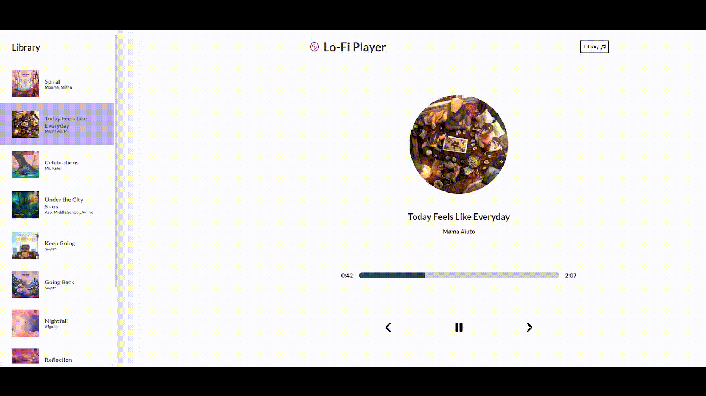

# Lo-Fi Music Player

> A minimalist lo-fi music player built with React and TypeScript. Streams curated tracks directly from the [Chillhop](https://chillhop.com) catalog.


🔗 **[Live Demo](https://ajs-react-music-player.netlify.app/)**



## About

Built as a hands-on exercise to practice React and TypeScript — specifically component architecture, custom hooks, and state management. The audio UI was a good excuse to explore SCSS theming and per-track dynamic styling.

## Features

- 🎵 Curated lo-fi tracks streamed live from the Chillhop catalog
- ⏯️ Full playback controls — play, pause, skip forward and backward
- 🎨 Seekable progress bar with a unique color gradient per track
- 📚 Collapsible library sidebar to browse all available tracks
- ⏭️ Auto-advances to the next track when a song ends

## Tech Stack

| Layer | Technology |
|-------|-----------|
| UI Framework | React 18 + TypeScript |
| Build Tool | Vite 6 |
| Styles | SCSS |
| Icons | FontAwesome |
| Audio Source | Chillhop Streaming API |

## Getting Started

```bash
git clone https://github.com/ajsevillano/react-music-player.git
cd react-music-player
npm install
npm run dev
```

Open [http://localhost:5173](http://localhost:5173) in your browser.

## Scripts

| Command | Description |
|---------|-------------|
| `npm run dev` | Start local development server |
| `npm run build` | Build optimised production bundle |
| `npm run preview` | Preview the production build locally |
| `npm run lint` | Run ESLint |

## Project Structure

```
src/
├── components/       # React components (Player, Library, Song, etc.)
├── hooks/            # Custom React hooks
├── data/             # Track data & types
├── styles/           # SCSS stylesheets
└── App.tsx           # Root component
```

## Disclaimer

This is a personal/educational project. All audio content belongs to [Chillhop Music](https://chillhop.com) and their respective artists.

## Contributing

Found a bug or have an idea? Feel free to open an issue.

## License

MIT
